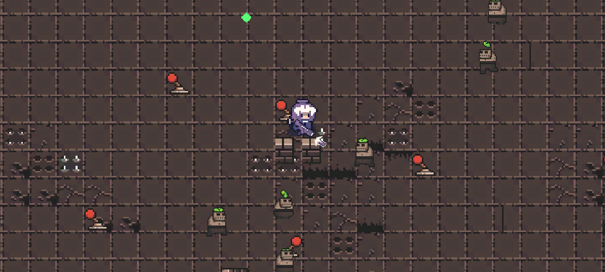
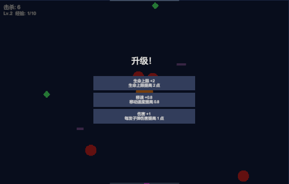
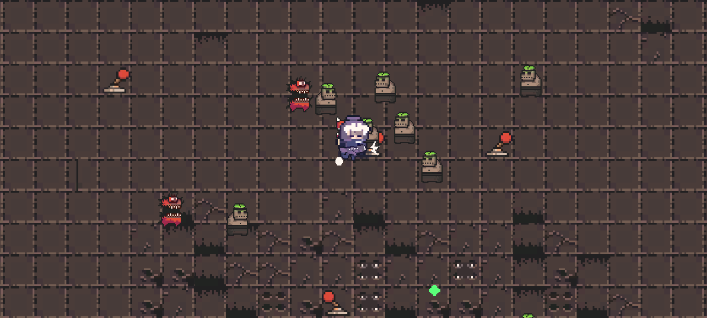

# Dark Dungeon（永夜幸存者）

一款 **Unity 2D 俯视角割草游戏**（类吸血鬼幸存者）：角色自动索敌开火，怪物成群追逐，击杀掉落经验、升级三选一，无尽波次逐步加压，直到阵亡结算。

**单人独立开发** · 团结引擎 1.10.3（内核 Unity 2022.3.62t15） · C#



---

## 玩法

- **自动战斗**：角色按武器节奏自动索敌开火，玩家只负责走位与躲避
- **成群追逐**：怪物从相机视野外生成，直线追踪玩家，数量随波次增长
- **掉落与成长**：击杀掉落经验宝石 → 磁吸拾取 → 升级触发**三选一强化**（生命上限 / 移速 / 伤害 / 射速 / 磁吸范围）
- **无尽波次**：每波有**固定刷怪预算**（第 1 波 10 只，每波 +5），刷满即停；清光后地图中心开启传送门，走入即进入下一波（地形与机关重新生成）
- **难度三档循环**：石穴 → 岩道 → 深渊，每 5 波换档，刷怪间隔 / 存活上限 / 怪种权重递增，档位循环使用
- **机关**：地刺按节拍伸缩（2.5s 周期 / 0.8s 伸出 / 0.4s 预警），3 帧逐帧动画，**动画与伤害判定共用同一时钟**，不会出现「看着没刺却掉血」

| 升级三选一 | 程序化地形 |
| --- | --- |
|  |  |

---

## 架构与实现

### 事件驱动解耦
- 静态 **事件总线**（11 类事件）解耦击杀 / 掉落 / 计分 / 升级 / 受伤 / 波次：生产者只广播事实，消费者 `OnEnable` 订阅、`OnDisable` 对称解绑
- 伤害统一走 `IDamageable` 接口，子弹不感知具体敌人类型；命中特效由独立池化 spawner 播发，表现层可整体替换

### 状态机（FSM）
- `WaveController` 用枚举 + **显式状态守卫**驱动波次流程（`Idle → Fighting → PortalOpen → Transitioning`）：只有 `Fighting` 才结算清场、只有 `PortalOpen` 才响应传送门事件，杜绝陈旧事件跳波
- `HazardCycle` 是纯函数式相位机（`Retracted / Warning / Extended`），把时钟映射到阶段与动画帧，**与伤害窗口同源**

### 数据驱动（零代码扩展）
- 7 张 **ScriptableObject** 配置表：敌人 / 武器 / 玩家 / 经验曲线 / 升级 / 升级池 / 难度档
- 新增敌人 = 预制体 + 数据资产 + 权重表；新增难度档 = 复制资产改数值，**不改底层代码**
- 资产运行时只读：随实例变化的状态（速度浮动、当前血量）只放组件，避免污染资产

### 程序化地形
- 三层 **Tilemap**：基础地板铺满墙内全域；变化层按噪声取「最吵的 N%」替换成变体瓦片（成团块，非均匀噪点）；装饰层稀疏叠加
- 所有道具按 **1 单位栅格对齐**（占地最小边贴整数格线），放置前做**占地占位校验**、中心安全区排除，并用**洪水填充做连通性回滚**，避免把玩家围死

### 性能优化
- 自研 **`ComponentPool<T>`** 对象池：懒创建、上限回收、自维护交接集合**拒绝重复与外来归还**、`OnEnable` 复位；覆盖子弹 / 怪物 / 宝石 / 特效 4 类高频对象；未池化对象自动回退 `Destroy`，保证行为一致
- 自研 **`SpatialGrid<T>`** 均匀空间哈希：增删改 **O(1)**（swap-and-pop + 槽位索引），最近邻查询按环扩展并带**早退剪枝**，查询**零分配**，替代全量遍历
- 相机自写阻尼跟随 + **逐轴边界钳制**（视野半宽/半高分别内缩，让墙正好出现在屏幕边缘），不引入 Cinemachine

---

## 目录结构

```
Assets/
├─ Scripts/
│  ├─ Common/      EventBus · ComponentPool · IPooledComponent · AudioBus · MusicPlayer · GameLayers
│  ├─ Combat/      IDamageable · Projectile · IntervalTimer · HitFx
│  ├─ Data/        7 张 ScriptableObject 配置类
│  ├─ Enemy/       Enemy · EnemyAI · ChaseSteering · EnemyManager · EnemySpawner · SpatialGrid
│  ├─ Stage/       WaveController · TerrainGenerator · PropPlacer · ArenaGrid · ArenaArea ·
│  │               StageBounds · StagePortal · StageFade · MapHazard · HazardCycle
│  ├─ Player/      PlayerMovement · PlayerAutoAttack · PlayerHealth · PlayerStatModifiers · PlayerRoll
│  ├─ UI/          HudController · UpgradeChoiceController · GameOverController · PauseMenu · SettingsMenu
│  ├─ Diagnostics/ 性能压测台架（分档生成 / 变体开关 / 采样报告）
│  └─ Tests/       EditMode + PlayMode 测试
├─ Data/           配置资产（Enemies / Weapons / Player / Levels / Upgrades / Tiers / Tiles）
├─ Prefabs/        Enemy · Enemy_Fast · Enemy_BigDemon · Bullet · Gem · Props/*
└─ Scenes/         StartMenu.scene（index 0） · Game.unity（index 1）
```

---

## 快速开始

1. 用 **团结引擎 1.10.3**（或 Unity 2022.3 LTS）打开工程
2. 打开 `Assets/Scenes/StartMenu.scene`，点击「开始游戏」
3. 操作：`WASD` 移动 · `Space` 翻滚 · `Esc` 暂停 · 攻击与索敌全自动

---

## 测试

工程带完整自动化测试（Unity Test Framework）：

| 套件 | 用例数 | 覆盖 |
| --- | --- | --- |
| EditMode | 142 | 空间网格 · 池化契约 · 输入缓冲 · 栅格吸附 · 占位/连通性 · 相位机 · 资产接线 |
| PlayMode | 153 | 伤害与无敌帧 · 波次全流程 · 地形生成 · 相机 · 音频 · UI |

在 Test Runner 里按 EditMode / PlayMode 分别运行即可（另有 1 个 `[Explicit]` 压测用例默认跳过）。

---

## 性能基准

`Scripts/Diagnostics/` 下是一套分档压测台架（预热收敛 → 变体开关 → 采样窗口），可通过 Test Runner 手动触发。

实测（编辑器内，200 只怪稳态，`Full` 变体）：

```
avg 1.92 ms · sd 0.40 ms · FPS 519.7 · GC 0.0 B/frame · batches 6 · draw 6 · active 200/200
```

台架支持 200 / 500 / 1000 三档负载，并可开关池化与空间网格做**对照实验**；采样指标含 avg/min/max/sd 帧耗时、FPS、每帧 GC 分配（`GC.GetAllocatedBytesForCurrentThread`）与 batches/setPass/draw（仅编辑器）。

---

## 已知限制与后续计划

- **无技能系统**：当前是「单武器 + 被动升级」，技能系统（技能池 / 技能 FSM / 技能对象池）在计划中
- **无存档**：仅用 `PlayerPrefs` 保存音量设置，无局外成长存档
- **资源加载**：目前全为直接引用，未接入 Addressables / 热更
- **无联网**：单机；若做多人会先定同步模型（本作数值简单，倾向帧同步 + 定点数）
- **渲染管线**：Built-in RP + 默认 Sprite 材质，无自定义 Shader

---

## 开发环境

| 项 | 值 |
| --- | --- |
| 引擎 | 团结引擎 1.10.3（`m_TuanjieEditorVersion`），内核 Unity 2022.3.62t15 |
| 关键包 | Input System 1.14.4-t4 · 2D Feature 2.0.1（Physics2D / Tilemap / SpriteShape） · TextMeshPro 3.0.9 · Test Framework 1.1.33 |
| 平台 | Windows Editor |
| 美术 | 16×16 像素素材（0x72 DungeonTileset II 等） |
